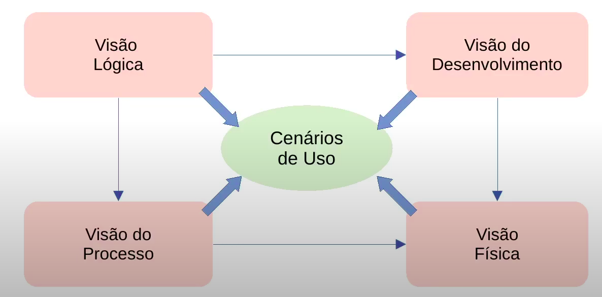

# Desafios em Projetos de Embarcados
 - Definir e capturar a estrutura do sistema
 - Limitações de custo
 - Determinar a integridade e confiabilidade do sistemma
 - Trabalhar com as limitações de recursos (potência, memória, duração da bateria)
 - Aspectos de MArketing e Venda
 - Requisitos determinísticos

- A *Arquitetura* de um sitema é um conjunto de visões que *descreve* os seus detalhes antes, durante e depois da implementação.

## Representar uma Arquitetura - Modelo de 4+1 visões
